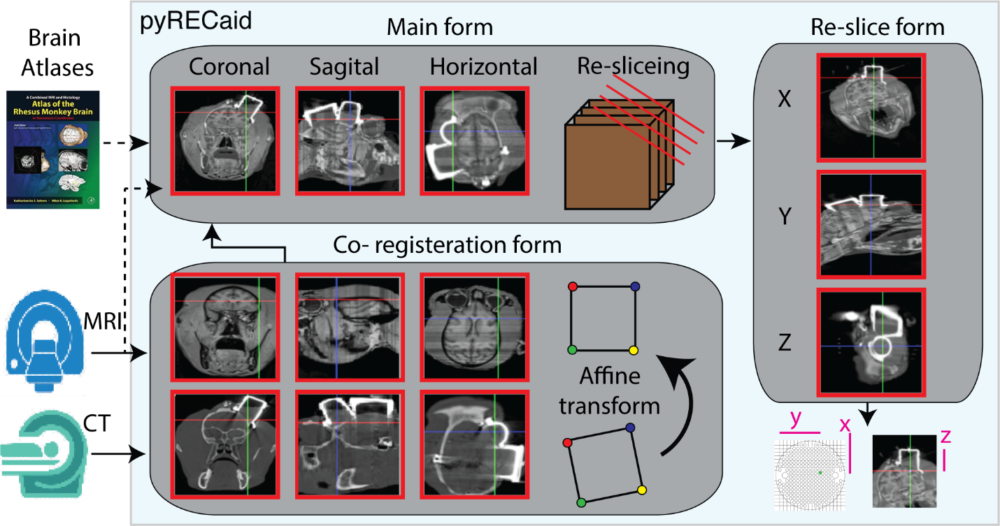

# pyRECaid


This is the git page for Python Recording Aid, pyRECaid, an open source utility for imaging-guided cerebral recording from primate subjects. It can also be used by experimentalists to deliver drugs into specific targets within the brain.

Available for Windows and Linux machines.

Tested platforms:
- Windows 10
- Ubuntu 20
- Ubuntu 18
- Ubuntu 16
- MacOs

# Overview

The application involved three main functional forms. The image data including MRI or CT were imported in both Main and Co-registration forms. In Co-registration image series were registered over each other by affine transformation, the results were sent to Main form. Re-slicing images were extracted from image data in the Main form. In the Re-slice form the precise information of brain region will be present in any new coordination system.

# Requirements
All the requirements are downloaded from python repositories (PyPI and conda channels) as described in the section on installation (see below). A list of the required libraries can also be found at ./files/requirements.txt.

# Installation Guide
Simply download or clone the directory to a desired location on your local system (extract the .zip file in case of downloading). Then redirect to this folder on your system to find the following files and folders:

main directory → here you will see the program scripts including the main method […].
Files → here you will see the manual.pdf containing user guide and the yml file for conda environment.

Prior to the installation you should have a distribution of Python3 interpreter installed on your system (we recommend the anaconda distribution). Instructions on how to run the program methods on Windows and Linux machines are described below:

#### Installing anaconda
Download the anaconda from [here](https://www.anaconda.com/products/individual) for your operating system. Then install then application and follow bellow procedure to install software requirements.
 
#### For Windows users:
After installation of Python3, open command prompt or the anaconda prompt (depending on your Python3 distro and path settings) and type the following commands at the prompt (case sensitive):
```sh
>> pip install scipy dicom PyQt5 matplotlib OpenCV-Python scikit-image transforms3d dill nibabel torch torchvision torchaudio
```

-	If you have python2 in your environment then you should type pip3 instead of pip in the above command since in that case pip defaults to Python2. 
It takes some time so be patient and wait for the transactions to finish and then enter:
```sh
>> conda install -c clinicalgraphics gdcm
```
-	In case you do not want to install anaconda, you can download the GDCM library [here](https://sourceforge.net/p/gdcm/gdcm/).

#### For Linux users:
Linux machines contain a system Python3. It is highly recommended that you don’t install the program using the system Python3. You are better to install a virtual environment by venv or conda (in case you have anaconda or miniconda) and then follow the instructions below.
Open a terminal with your desired python3 environment activated and type in the following line:
```sh
>> pip install scipy==1.2.0 dicom PyQt5 matplotlib OpenCV-Python scikit-image transforms3d dill nibabel torch==1.10.2+cpu torchvision==0.11.3+cpu torchaudio==0.10.2+cpu -f https://download.pytorch.org/whl/cpu/torch_stable.html
```
-	If you have python2 in your environment then you should type pip3 instead of pip in the above command since in that case pip defaults to Python2. 
-	It takes some time so be patient and wait for the transactions to finish and then enter:
```sh
>> conda install -c clinicalgraphics gdcm
```
-	In case you do not want to install anaconda, you can download the GDCM library [here](https://sourceforge.net/p/gdcm/gdcm/).

#### yml file installation
Installing from yml file is the easiest way to execute the software. To after installing the anaconda open a terminal (Linux/Mac) or anaconda command prompt (Windows) and create a new environment by running:
```sh
>> conda env create -f environment.yml
```
By running this command a new environment will be created under the name "pyRECaid". By executing the bellow command you can see the existing environments in your device.
```sh
>> conda env list
```
If the installation process runs successfully, you should be able to see the "pyRECaid" environment under the exported list.  After installing successfully, you have to activate the environment by running:
```sh
>> conda activate pyRECaid
```
After activating the environment, go to the cloned code directory on your system and run:
```sh
>> python3 Main.py
```
Thereafter, the software starts and ready to be used.


# Running the Software
Redirect to the %directory of downloaded files%/src/and run Main.py

# Sample Data
A dcmf file is provided in the Data directory of the project and it could be loaded by selecting open from file menu. This sample data is processed by this software. Furthermore, there exist raw MR and CT that could be downloaded from [here](https://drive.google.com/file/d/1HtTGseKm5HR0GKWeYhZnaZP4V2fxQOVe/view?usp=sharing).

# User guide
A user guide, manual.pdf, can be found at the src directory.

# Contact Information
You are welcome to send your questions or suggestions about the program to Pouya Narimani to pouya.narimani@ut.ac.ir or Hamed Heirari Gorji to hamed.h@live.com. You are also encouraged to take part in the future developments of the project and to tailor the program according to your needs.

# Suggestions for Further Development:
Suggestions in this sections can be incorporated into the future editions of the program either by the original developers or any other interested individual. The current listing:
-	Adding a 3d view of the MR and CT series
-	Addition of a logger for keeping track of targeted areas between sessions

# Citation
If pyRECaid helps your research, please cite our paper in your publications.

```
@article{Rezayat_2022,
	doi = {},
	url = {},
	year = 2022,
	month = {},
	publisher = {Elsevier},
	volume = {},
	number = {},
	author = {Ehsan Rezayat, Hamed Heidari-Gorji, Pouya Narimani, Farzad Shayanfar, Jalaledin Noroozi, Abolhasan Ertiaei, Mohammad-Reza A.
	Dehaqani},
	title = {A Multimodal Imaging-guided Software for Access to Primate Brains},
	journal = {Heliyon}
}
```
